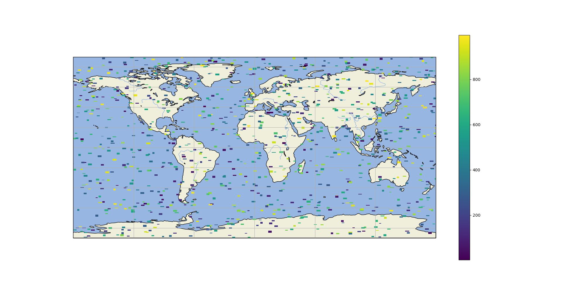

## Map CR8R
This project is intended to allow users to quickly be able to plot data. 

feature demo July 8 2020

# supported features

# Sample Plot Map

Plots points on map in given bounds using a lat/long column.
# Sample 3D Heat Map

Creates a kdeplot fitting and plotting a univariate kernel density estimate.
# Sample Shape plot map

Plots a shapefile onto a map in given bounds, optionally plots a column and provides a legend if selected.
# Sample shape generator

Product of shape_generator.py. Allows users to create n number of shapes with random locations in x,y,x1,y1 bounds.

# Requirements
- PySimpleGUI
- geopandas
- pandas
- cartopy.crs
- cartopy
- matplotlib.pyplot
